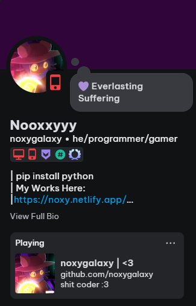

# Simple RPC | CLI

Everything is customizable! :3



## Installation
1. Install [Python 3.X](https://www.python.org/) if you haven't already.
2. Install source code and run `install.bat` ( it's gonna download required libraries! )
3. Go to [Discord Developers](https://discord.com/developers/applications/) and login into your account.
4. Create new application and copy "Application ID" after you created app.
5. After console closed, run `start.bat` ( it's gonna start main program!)
6. Enter Details -> State -> AppID -> Image (optional)
7. Done! RPC should appear in your discord profile! <3

## Args usage
You can configure `prepared_config.bat` file or follow steps below ⬇️
1. Open `cmd`.
2. Use `cd "path-to-simple-cli-rpc"`
3. Then you can use this:
```
python "main.py" --details "first line" --state "second line" --appid "0000000000000000000" --image "your_image_name"
```
and change "first line" and etc. to something, as i said using "--image" optionally

## I Found a bug!
You can send it into [Issues](https://github.com/noxygalaxy/simple-cli-rpc/issues) and i will try to reply quick as possible!

# GIMME A STAR IF YOU LIKE IT!!!
